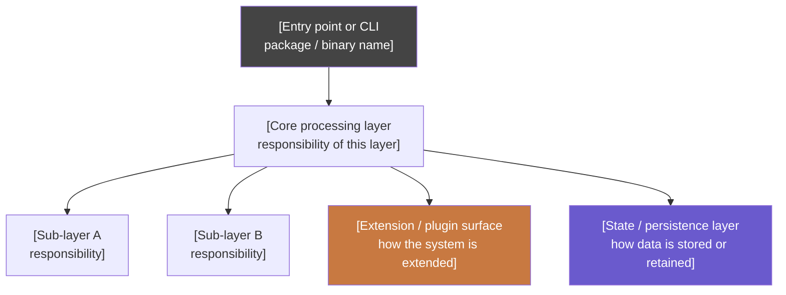
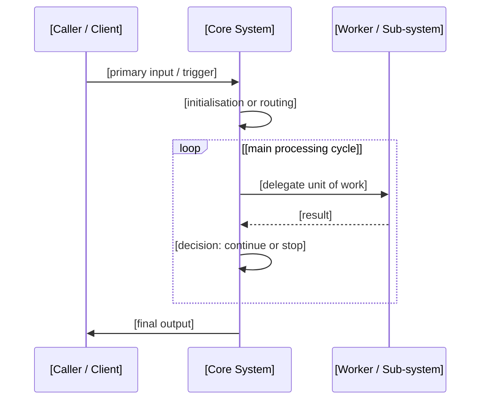
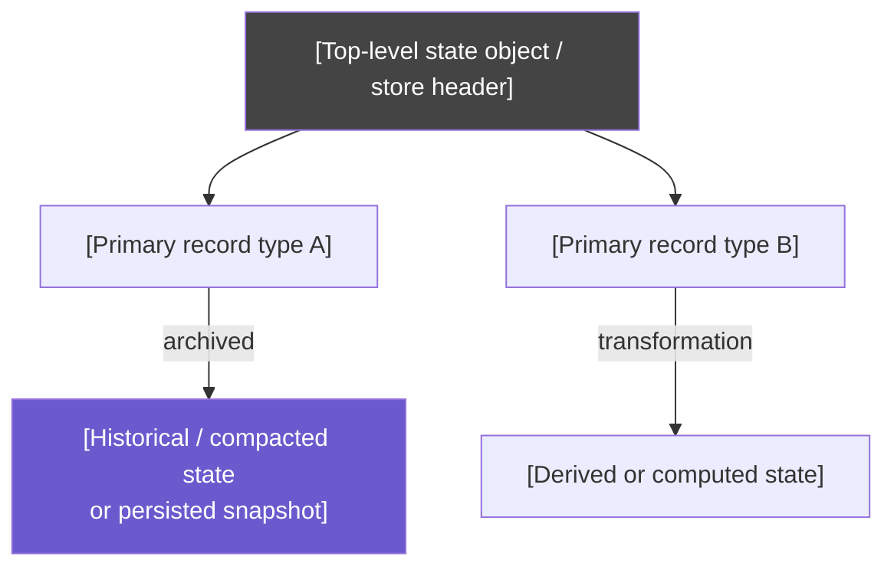
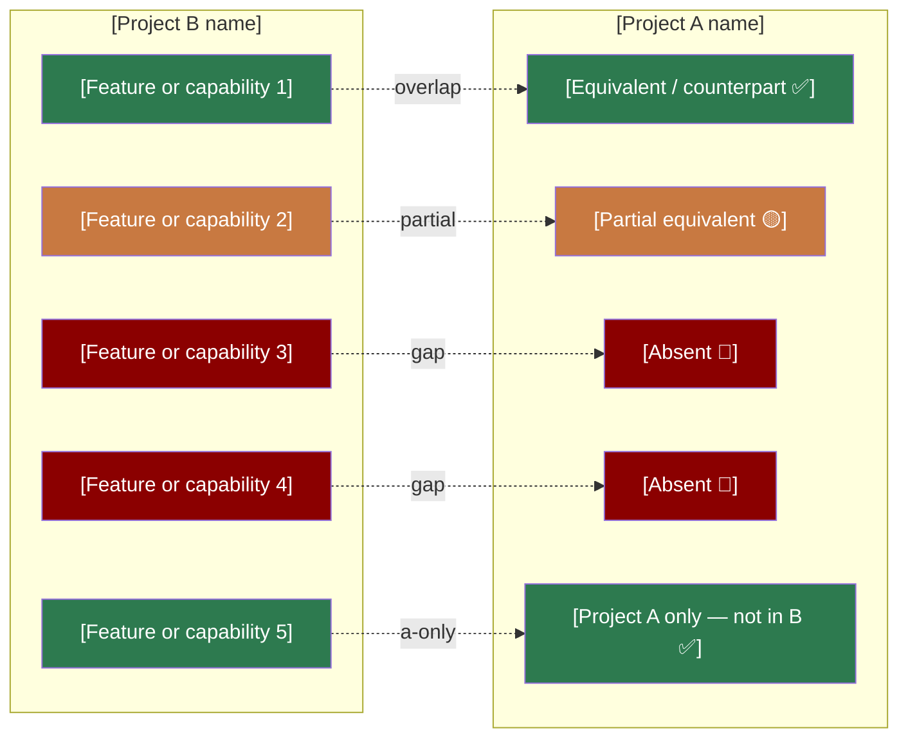

# Diagram Guide — smaqit.parity-assess

**Version:** 2.0.0  
**Read before:** every Phase 3 diagram in a parity assessment.

This guide defines which diagram type maps to each output slot, the semantic colour palette, structural rules, and Mermaid syntax pitfalls to avoid. Templates here are structural skeletons — replace every `[slot]` with content derived from the systems being compared.

---

## Colour Palette

Colours are semantic — they communicate parity status, not domain. Apply them consistently in every diagram.

| Meaning | Fill | Text | When to apply |
|---------|------|------|---------------|
| Feature present / equivalent | `#2d7a4f` | `#fff` | Both systems have this; or it exists in the system being diagrammed |
| Feature partial / degraded | `#c87941` | `#fff` | Present but limited, sequential-only, or incomplete |
| Feature absent / gap | `#8b0000` | `#fff` | Missing in one system; a parity gap |
| State / persistence layer | `#6a5acd` | `#fff` | Any node representing stored or managed state |
| Extension / plugin layer | `#c87941` | `#fff` | Any node representing extensibility or plugin surfaces |
| Neutral / infrastructure | `#444` | `#fff` | Headers, entry points, config, build artifacts |

Apply via `style NodeId fill:#hexcode,color:#fff`.

**In architecture and flow diagrams (diagrams 1–3):** colour nodes by their role in the system (state = purple, neutral entry = dark grey, etc.).  
**In the feature gap diagram (diagram 4):** colour nodes by parity status (green = present, orange = partial, red = absent).

---

## Diagram 1 — Architecture (`flowchart TD`)

**Purpose:** Show Project B's structural layers — what components/packages/modules exist and how data flows through them top-to-bottom.

**Structural skeleton:**

**Rules:**
- Derive layers from what the system *actually is* — not from a template. A web framework has routes/middleware/handlers; a build tool has tasks/targets/runners; an agent has a loop/tools/memory.
- One node per major conceptual layer; do not map to source files 1:1.
- Multi-line labels: use `\n` inside `["..."]`; wrap at ~40 characters.
- Maximum 12 nodes — aggregate small helpers into their parent layer.
- Arrows follow data/control flow, not import dependency.

---

## Diagram 2 — Core Processing Flow (`sequenceDiagram`)

**Purpose:** Show how Project B handles one complete primary operation — from the triggering input to the final output. The nature of this operation depends on the system:

| System type | Primary operation |
|------------|------------------|
| Agent / assistant | User prompt → LLM turn(s) → response |
| Web framework | HTTP request → middleware chain → response |
| Build tool | Command invocation → task graph execution → artifacts |
| Data pipeline | Ingestion event → transform stages → sink |
| Library / SDK | API call → internal computation → return value |

**Structural skeleton:**

**Rules:**
- Maximum 4 participants — combine if needed.
- Use `loop` for any cycle; use `alt / else` for branches.
- Add `note over Participant: text` for non-obvious state transitions.
- Omit `activate/deactivate` — it adds noise without clarity.
- `note over A,B:` (two participants) uses comma, not a range.
- If there is no meaningful processing cycle (e.g., a pure library), draw a flat call-and-return sequence instead.

---

## Diagram 3 — State / Data Model (`flowchart TD`)

**Purpose:** Show how Project B structures and retains state — sessions, schemas, trees, stores, or event logs.

**Use this diagram only if Project B has a non-trivial state or data model** (persistent storage, branching, schemas, versioning, event sourcing).

**Omit this diagram if:**
- The system is stateless across invocations
- State is trivially a flat key-value store with no interesting structure
- Document the omission in the ASSESSMENT instead

**Structural skeleton:**

**Rules:**
- Show the *structure* of the data model, not a flowchart of operations.
- Use distinct colours only for structurally distinct layers (e.g., live vs. archived state).
- If the model has tree or graph structure (e.g., parent/child entries), show that topology explicitly.

---

## Diagram 4 — Feature Gap (`flowchart LR`)

**Purpose:** Side-by-side comparison of Project B vs Project A, colour-coded by parity status. This is the primary decision-support diagram.

**Structural skeleton:**

**Rules:**
- Derive features from what was discovered in Phases 0 and 1 — not from this template.
- Apply **identical colours to matching rows** on both sides — the visual alignment is the primary signal.
- Status emoji in node labels supplements colour: ✅ present · 🟡 partial · 🔴 absent.
- Edge labels: `overlap` (both have it) · `partial` (similar but degraded) · `gap` (absent in A) · `a-only` (Project A has it, B does not) · `different` (exists in both, incompatible).
- Include `a-only` rows if Project A has meaningful capabilities the reference system lacks — these justify why simple adoption isn't always the right answer.
- Maximum 6–8 rows per subgraph — aggregate minor features.

---

## Common Mermaid Pitfalls

| Issue | Rule |
|-------|------|
| Parentheses in node label | Always quote: `A["label (with parens)"]` |
| Colon in node label | Always quote: `A["key: value"]` |
| Arrow bracket in node label | Always quote: `A["type<T>"]` |
| Multi-line label | Use `\n` inside `["..."]` |
| `note over` two participants | Comma syntax: `note over A,B: text` |
| Node referenced outside its subgraph | Define the node inside the subgraph first |
| Edge label with spaces | Quote: `A -->|"label text"| B` |
| Style declarations | Place all `style` lines at the end of the diagram |
