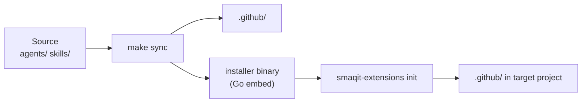

# Create smaqit.project-recap Skill

**Status:** Not Started
**Created:** 2026-05-09

## Description

Create a new `smaqit.project-recap` skill that generates a live project dashboard — a rich, structured snapshot of where the project stands RIGHT NOW based on its actual state, not on task history, completed tasks, or session logs.

The skill scans the project's live codebase and configuration to produce a dashboard-style output that combines Mermaid diagrams, tables, and bulleted lists. It writes a persistent snapshot to `.smaqit/project-recap.md` (overwritten on each run) and also renders the output directly in chat.

This is explicitly NOT `smaqit.session-recap`, which summarizes what happened in a session. `smaqit.project-recap` answers: "What is this project right now?" — its architecture, its components, its top-level dependencies, and its active process state.

## Design Decisions (confirmed)

- **Data sources:** Scan the live project solution — source files, manifests, configuration files, directory structure. Do NOT read task files, PLANNING.md, or session history — these are stale or out-of-sync states.
- **Tech stack graph:** Top-level dependencies only. Architectural and component view. No transitive dependencies, no method-level trace.
- **File metrics:** Process/task state only. No LOC counts, no language breakdown.
- **Storage:** Writes to `.smaqit/project-recap.md` (idempotent — overwrites on each run). Also renders in chat.
- **Trigger:** `project.recap` (explicit invocation) or `project.recap --refresh` (force re-scan even if output file exists)
- **Blockers:** Inferred from project state only — do not extract from task files. If there are no programmatic blockers (e.g., failing CI, broken manifest), the blockers section is omitted or marked "None detected".

## Dashboard Sections

The generated dashboard must include the following sections in order:

### 1. Project Header
- Project name (from README.md or package.json/go.mod/Cargo.toml)
- Version (from version file or CHANGELOG.md `[Unreleased]` / latest release)
- Primary language and runtime
- Entry points (e.g., `installer/main.go`, `install.sh`)

### 2. Architecture Overview (Mermaid — flowchart or block diagram)
A Mermaid diagram showing the top-level architectural components and how they relate. For smaqit-extensions this would show: Source (`agents/`, `skills/`) → Sync (`make sync`) → Distribution (`.github/`, installer binary, `install.sh`). For other projects, derive from actual structure.



### 3. Component Map (Mermaid — graph or table)
Top-level components with their type and purpose. For skills/agents repos: list each skill/agent with its category. For code repos: list major packages/modules.

### 4. Dependency Graph (Mermaid — flowchart or block diagram)
Top-level external dependencies only — frameworks, runtimes, tools. Derived from: `go.mod`, `package.json`, `requirements.txt`, `Cargo.toml`, `Makefile` tool references. No transitive/indirect dependencies.

### 5. Directory Structure (ASCII tree)
A minimal ASCII tree of the project's key directories and their purpose. Not a full `tree` output — curated to show the meaningful structure.

```
smaqit-extensions/
├── agents/          — source agent definitions (3)
├── skills/          — source skill implementations (20)
├── installer/       — Go binary (main.go, embed)
├── templates/       — project scaffolding templates
├── .github/         — synced agents + skills (Copilot uses these)
└── .smaqit/         — project management state
```

### 6. Active Skills and Agents (table)
| Name | Category | Version | Description (1 line) |
|------|----------|---------|---------------------|

Derived by scanning all `SKILL.md` and `*.agent.md` frontmatter in the source directories. Not read from PLANNING.md.

### 7. Key Configuration Files (table)
| File | Purpose |
|------|---------|
List all significant config/manifest files found in the project.

## Skill Implementation Steps

1. **Read project manifests** — read `README.md`, `go.mod`/`package.json`/etc., `Makefile`, `.github/copilot-instructions.md` (if present). Extract: project name, version, language, entry points, external dependencies.

2. **Scan source directories** — run `scripts/scan-metadata.py` (see script spec below) to batch-extract frontmatter from all `agents/*.agent.md` and `skills/*/SKILL.md` files. Process the JSON output to build the component map and active skill/agent table.

3. **Derive architecture** — from manifest files and directory structure, construct the top-level architectural flow (what feeds what, how distribution works).

4. **Build Mermaid diagrams** — generate Architecture Overview and Dependency Graph diagrams. Validate syntax mentally before writing (prefer `flowchart LR` or `block-beta` for clean layout).

5. **Build ASCII directory tree** — curated, not exhaustive. Show 2-3 levels max, with purpose annotations.

6. **Assemble dashboard** — compose all sections in order. Ensure the output is self-contained: anyone reading `.smaqit/project-recap.md` without context should understand the project.

7. **Write to `.smaqit/project-recap.md`** — overwrite if exists. Include header with generation timestamp.

8. **Render in chat** — output the full dashboard inline for immediate review.

## Script: scripts/scan-metadata.py

The skill must include a `scripts/scan-metadata.py` script. Per the agentskills.io spec, when an agent would independently reinvent the same logic each run — here, finding all skill/agent files and extracting their frontmatter — that is the signal to bundle a tested script.

**What it does:**
- Accepts one argument: the root directory to scan (e.g., the workspace root)
- Finds all files matching `agents/*.agent.md` and `skills/*/SKILL.md` under that root
- Extracts frontmatter fields: `name`, `description`, `metadata.version` (or `version` under metadata)
- Outputs newline-delimited JSON to stdout: one object per file, fields: `type` ("skill"|"agent"), `name`, `version`, `description`, `path`
- Sends progress and warnings to stderr (not stdout)
- Returns exit code 0 on success, non-zero on failure with a clear error message
- No interactive prompts — all input via command-line arguments
- Idempotent — safe to re-run

**Script design requirements (per agentskills.io using-scripts spec):**
- Include a `--help` flag documenting usage, arguments, and output format
- Use structured stdout (newline-delimited JSON) so the agent can parse with standard tools
- Separate data (stdout) from diagnostics (stderr)
- Declare inline dependencies using PEP 723 `# /// script` syntax (e.g., `pyyaml` for frontmatter parsing), runnable via `uv run scripts/scan-metadata.py <root>`
- Handle missing directories and unreadable files gracefully (warn on stderr, continue)
- Include meaningful exit codes: 0 = success, 1 = no files found, 2 = argument error

**Invocation in SKILL.md:**
```
Run: uv run scripts/scan-metadata.py "<workspace-root>"
Capture stdout (newline-delimited JSON). Each line is one component entry.
```

**File location:** `skills/smaqit.project-recap/scripts/scan-metadata.py`

## Output File Header

```markdown
# Project Recap

> Generated: YYYY-MM-DD HH:MM | Source: live project scan | Run: `project.recap`

---
```

## Acceptance Criteria

- [ ] `skills/smaqit.project-recap/SKILL.md` created with correct frontmatter: `name: smaqit.project-recap`, `description` mentioning trigger phrases (`project.recap`, `project.recap --refresh`), `metadata.version: "0.1.0"`, `compatibility` field noting `uv` is required for script execution
- [ ] `skills/smaqit.project-recap/scripts/scan-metadata.py` created: accepts workspace root argument, outputs newline-delimited JSON per file (type, name, version, description, path), PEP 723 inline dependencies, `--help` flag, structured stdout/stderr separation, exit codes documented
- [ ] Trigger `project.recap` — generates full dashboard from live project scan and writes to `.smaqit/project-recap.md`
- [ ] Trigger `project.recap --refresh` — forces re-scan even if output file exists; overwrites previous output
- [ ] Dashboard includes all 7 sections in order: Project Header, Architecture Overview (Mermaid), Component Map, Dependency Graph (Mermaid), Directory Structure (ASCII), Active Skills/Agents (table), Key Configuration Files (table)
- [ ] Data sources are live only: source files, manifests, frontmatter — NOT task files, PLANNING.md, or session history
- [ ] Mermaid diagrams use valid syntax (test for smaqit-extensions itself as the reference case during implementation)
- [ ] ASCII directory tree is curated (2-3 levels, annotated), not a raw dump
- [ ] Output is idempotent: re-running `project.recap` overwrites `.smaqit/project-recap.md` cleanly
- [ ] Handles missing optional sections gracefully (e.g., no `go.mod` → omit Go-specific dependency section)
- [ ] All files synced to `.github/` via `make sync`
- [ ] `README.md` updated: skill added to Project Management section; skill count incremented
- [ ] PLANNING.md updated to mark this task Completed

## Files to Create / Modify

| File | Action |
|------|--------|
| `skills/smaqit.project-recap/SKILL.md` | Create |
| `skills/smaqit.project-recap/scripts/scan-metadata.py` | Create — frontmatter batch scanner |
| `skills/smaqit.project-recap/references/OUTPUT_FORMAT.md` | Create — dashboard section format templates and Mermaid examples |
| `.github/skills/smaqit.project-recap/SKILL.md` | Synced via `make sync` |
| `.github/skills/smaqit.project-recap/scripts/scan-metadata.py` | Synced via `make sync` |
| `.github/skills/smaqit.project-recap/references/OUTPUT_FORMAT.md` | Synced via `make sync` |
| `README.md` | Modify — add skill to Project Management, increment count |
| `.smaqit/tasks/PLANNING.md` | Modify — mark completed |

## Notes

- The skill should be opinionated: always generate all sections, even if some are sparse. A sparse section (e.g., "No external dependencies detected") is better than a missing section.
- The skill must NOT read `.smaqit/tasks/PLANNING.md` or individual task files — these may be stale.
- The `--refresh` flag is a soft directive to the agent: treat the output file as absent and regenerate from scratch.
- Mermaid diagrams should be kept simple enough to render without layout errors. Prefer `flowchart LR` over complex graph types.
- The skill should self-validate its Mermaid output against the known syntax (test with the smaqit-extensions project structure as reference during authoring).
- **Progressive disclosure (spec requirement):** Keep `SKILL.md` under 500 lines and 5,000 tokens. The dashboard section definitions (formats, examples, expected output) are substantial — move detailed output format templates and Mermaid examples to `references/OUTPUT_FORMAT.md` and reference them conditionally: "Read `references/OUTPUT_FORMAT.md` for section-by-section format templates before generating the dashboard."
- **Gotchas to include in SKILL.md:** (1) `skills/` and `agents/` directories may not exist in all projects — scan defensively and skip sections with no data rather than erroring; (2) `uv` may not be installed — add a fallback instruction: if `uv` is unavailable, the agent reads frontmatter files sequentially instead of running the script; (3) Mermaid diagrams with many nodes (>15) may fail to render in some clients — keep component maps to top-level groupings, not individual skills.
